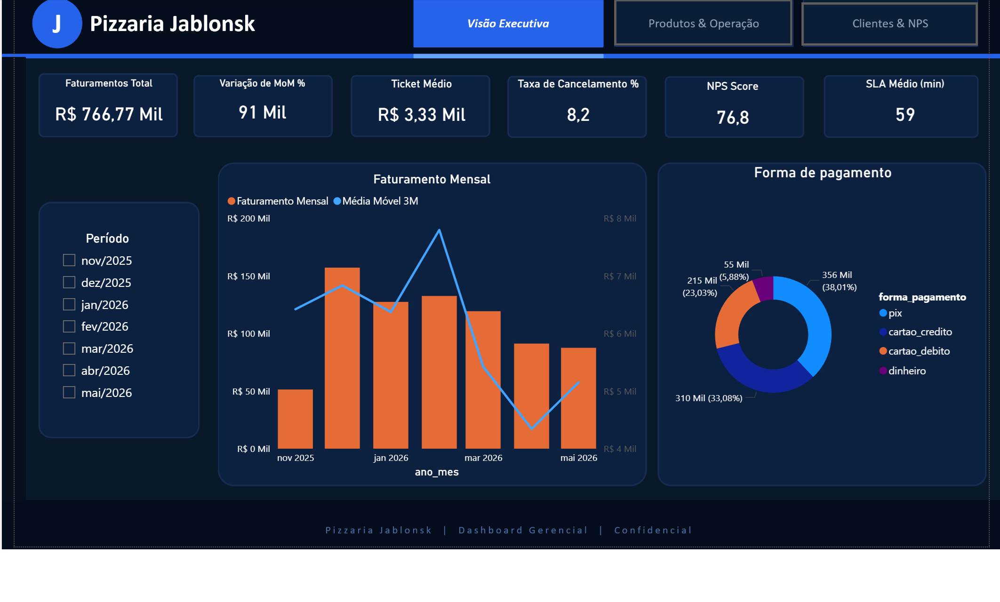
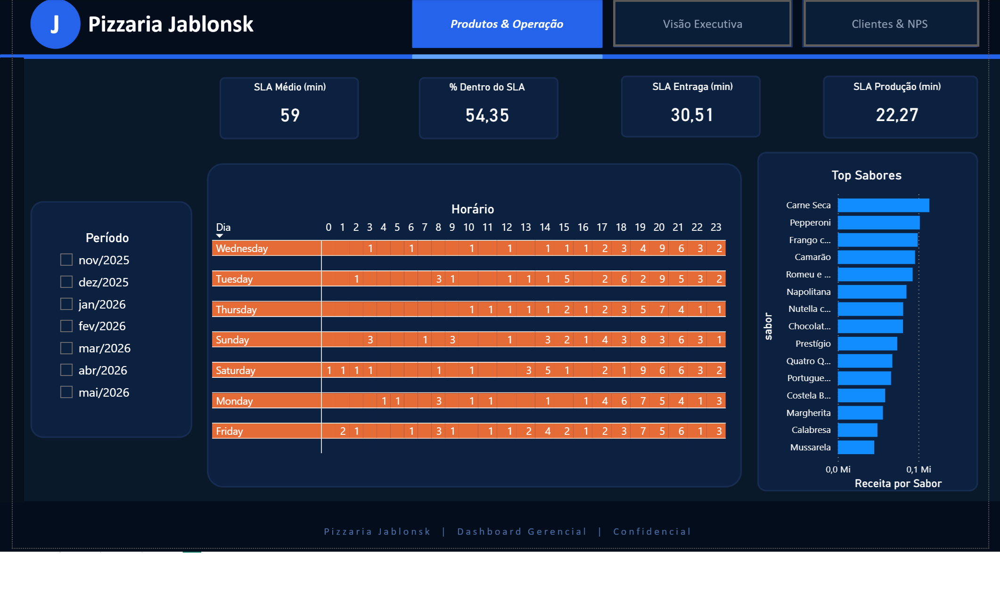
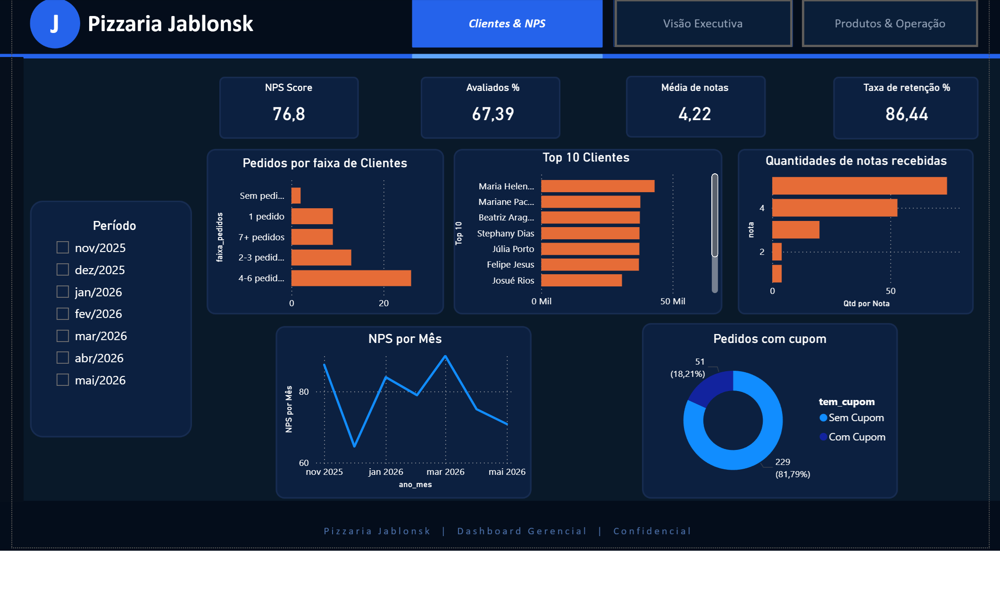

# 🍕 Pizzaria Jablonsk — Pipeline de Dados End-to-End


Pipeline completo de engenharia de dados sobre um sistema fictício de pizzaria delivery.  
Demonstra o fluxo completo: **modelagem relacional → ETL → análise exploratória → dashboard BI**.

**Demo ao vivo:** [nato.pythonanywhere.com](https://nato.pythonanywhere.com)  
**Portfólio:** [natoawayrj.github.io](https://natoawayrj.github.io)

---

## Stack

| Camada | Tecnologia |
|---|---|
| Banco de dados | MySQL 8.0 (local) · SQLite (deploy demo) |
| ETL / Geração de dados | Python · Faker · Pandas · SQLAlchemy |
| Análise exploratória | Jupyter Notebook · Matplotlib · Seaborn |
| Dashboard | Power BI · DAX |
| Backend (sistema operacional) | Flask · Jinja2 |
| Infra | PythonAnywhere · GitHub Pages |

---

## Arquitetura do Pipeline

```
MySQL 8.0
  └── database/schema_pizzaria.sql    ← Modelagem relacional + star schema (views)
        │
        ├── scripts/faker_seed.py     ← Geração de dados sintéticos (Faker)
        │     60 clientes · 280 pedidos · 6 meses · ~155 avaliações
        │
        ├── scripts/export_csv.py     ← Exportação para Power BI
        │     └── data/exports/       ← 10 arquivos CSV (fato + dimensões)
        │
        └── notebooks/analise_pizzaria.ipynb  ← 12 análises exploratórias
              └── Power BI (powerbi/dax_measures.md)
                    └── Dashboard executivo (3 páginas)
```

---

## Modelo de Dados

Star schema implementado via VIEWs sobre o modelo operacional:

- **`fato_pedidos`** — métricas financeiras, SLA, NPS por pedido
- **`dim_clientes`** — faixa etária, mês de cadastro, segmentação
- **`dim_produtos`** — sabores e produtos unificados com categoria

Tabelas operacionais: `clientes`, `enderecos`, `pedidos`, `itens_pedido`,  
`itens_pedido_sabores`, `sabores`, `produtos`, `massas`, `bordas`, `cupons`,  
`avaliacoes`, `status_historico`, `admin_usuarios`

---

## Principais Insights

> Descobertas extraídas dos 280 pedidos gerados sobre 6 meses de operação.

**Concentração de demanda**  
Sexta e sábado concentram **33% de todos os pedidos** — cada um com 16,5% do volume semanal. O horário de pico é das 19h às 21h, com 98 pedidos registrados nessa janela (40% do total entregue).

**Sabores líderes**  
Carne Seca e Romeu e Julieta lideram empatados com **63 pedidos cada**, seguidos por Chocolate com Morango (56). Dois sabores doces entre os três mais pedidos — dado que justifica expandir a categoria doces no cardápio.

**Comportamento de pagamento**  
Clientes que pagam com **cartão de crédito gastam em média R$ 13,27 a mais** do que os que pagam via Pix (R$ 101,02 vs R$ 87,75). Pedidos via Pix têm menor ticket mas maior volume — representam a forma de pagamento mais popular.

**Retenção e recorrência**  
**84,2% dos clientes fizeram mais de um pedido** no período. Taxa de cancelamento de 8,2% — abaixo do benchmark do setor (~10–12%). 18,2% dos pedidos utilizaram cupom de desconto, indicando que promoções impactam diretamente a conversão.

**SLA operacional**  
Tempo médio de ciclo completo: **59,2 minutos** (recebido → entregue). Espaço para otimização na etapa de produção, que responde pela maior parte do tempo total.

---

## Dashboard Power BI (3 páginas)

| Página | Conteúdo |
|---|---|
| **Visão Executiva** | Faturamento, Ticket Médio, NPS, Variação MoM%, Média Móvel 3M |
| **Produtos & Operação** | Top sabores, heatmap hora × dia, SLA por etapa |
| **Clientes & NPS** | LTV, distribuição de notas, taxa de retenção, cupons |





---

## Como rodar localmente

### Pré-requisitos
- Python 3.10+
- MySQL 8.0
- Anaconda (recomendado)

### Setup com MySQL

```bash
# 1. Clone o repositório
git clone https://github.com/natoawayrj/pizzaria-jablonsk.git
cd pizzaria-jablonsk

# 2. Instale as dependências
pip install -r requirements.txt

# 3. Configure as variáveis de ambiente
cp .env.example .env
# Edite .env com suas credenciais MySQL

# 4. Crie o schema e popule o banco
mysql -u root -p < database/schema_pizzaria.sql
python scripts/faker_seed.py

# 5. Exporte os CSVs para o Power BI
python scripts/export_csv.py

# 6. Rode o servidor Flask
python run.py
```

Acesse em `http://localhost:5000`

### Setup demo (SQLite — sem MySQL)

```bash
python scripts/init_sqlite.py  # cria banco SQLite com dados estáticos
python run.py
```

---

## Estrutura do Projeto

```
pizzaria-jablonsk/
├── app/                        # Flask (sistema de pedidos)
│   ├── auth.py                 # Login e cadastro de clientes
│   ├── cardapio.py             # Cardápio e página inicial
│   ├── pedido.py               # Fluxo de pedido e checkout
│   ├── admin.py                # Painel administrativo
│   └── db.py                   # Conexão via SQLAlchemy
├── database/
│   └── schema_pizzaria.sql     # Schema MySQL + star schema + seed estático
├── notebooks/
│   └── analise_pizzaria.ipynb  # 12 análises exploratórias com gráficos
├── scripts/
│   ├── faker_seed.py           # Geração de 280 pedidos sintéticos (Faker)
│   ├── export_csv.py           # Exportação para Power BI
│   ├── init_sqlite.py          # Init banco SQLite (deploy demo)
│   └── setup_admin.py          # Troca senha do admin
├── powerbi/
│   └── dax_measures.md         # Medidas DAX + sugestão de layout
├── data/
│   └── exports/                # CSVs exportados para Power BI
├── img/                        # Screenshots do dashboard (3 páginas)
├── templates/                  # Templates Jinja2
├── static/                     # CSS, JS, imagens do cardápio
├── .env.example                # Variáveis de ambiente necessárias
└── requirements.txt
```

---

## Análises no Notebook

1. Faturamento mensal e crescimento MoM
2. Ticket médio por forma de pagamento
3. Top 10 sabores por receita
4. Heatmap de pedidos por hora e dia da semana
5. Análise de SLA (tempo por etapa do pedido)
6. Distribuição de NPS e notas
7. LTV e frequência por cliente
8. Impacto de cupons no faturamento
9. Taxa de cancelamento por período
10. Análise de retenção (clientes recorrentes)
11. Mix de produtos (pizza vs avulsos)
12. Correlação entre ticket médio e avaliação

---

## Limitações e Próximos Passos

- Dados sintéticos gerados com Faker — padrões reais de sazonalidade não estão presentes
- Deploy demo usa SQLite; produção real exigiria MySQL gerenciado (RDS, PlanetScale)
- Próxima evolução: substituir Faker por dados reais do sistema Flask em produção

---

## Autor

**Renato Batista**  
[LinkedIn](https://linkedin.com/in/renatosantos1978) · [GitHub](https://github.com/natoawayrj) · [Portfólio](https://natoawayrj.github.io)
